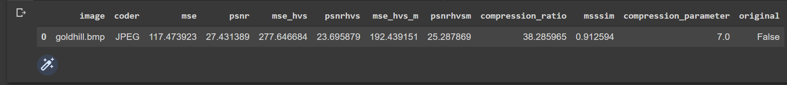
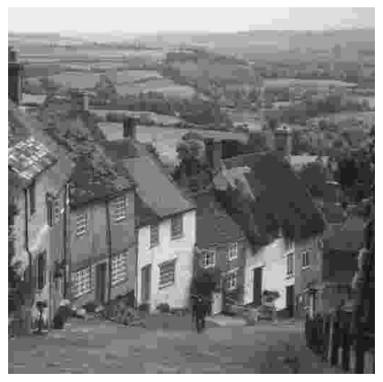

[](https://creativecommons.org/licenses/by-nc/4.0/)

# Compression of grayscale images

### [Department of Information and Communication Technologies](https://dict.khai.edu/) of National Aerospace University 'Kharkiv Aviation Institute'
---
### Usage
- Fork project
- Create 'XAI' folder in root folder on your Google Drive
- Copy project into XAI folder
- Run k504_grayscale_compression.ipynb in Colab
---
### WINE install
WINE allows you to run any Windows EXE-file under Linux environment (including Colab).
It's NOT necessary for BPG nor JPEG coders. Notebook consists necessary part for WINE installation. Enter next commands after executing '!sudo su' in cell:
- apt install wine-stable
- dpkg --add-architecture i386 && apt-get update && apt-get install wine32
- exit
---
### Example
```bash
imageArray, cimageArray, cr = get_compressed_image_II(path_to_root_folder, 'goldhill.bmp', 'JPEG', '7')
```
```bash
local_df = get_metrics('goldhill.bmp', 'JPEG', imageArray, cimageArray, cr, '7', original_image=False)
local_df.head()
```
<p align="center">

</p>

```bash
plot_numpy2D(cimageArray, pedestal=0)
```
<p align="center">

</p>

---
### Coders
- [AGU, AGUm](http://www.ponomarenko.info/agu.htm), [ADCT, ADCTm](http://www.ponomarenko.info/adct.htm) (512x512 images only)
- [BPG](https://bellard.org/bpg/)
- [JPEG](https://docs.opencv.org/4.x/d4/da8/group__imgcodecs.html)
- [JPEG2000](https://www.openjpeg.org/)
### Metrics
- [PSNR](https://docs.opencv.org/4.x/d8/d0c/classcv_1_1quality_1_1QualityPSNR.html)
- [PSNR-HVS, PSNR-HVS-M](http://www.ponomarenko.info/psnrhvsm.htm)
- [SSIM, UQI, MS-SSIM, ERGAS, SCC, RASE, SAM, D_lambda, D_S, QNR, VIF, PSNR-B](https://pypi.org/project/sewar/)
---
### Miscellaneous
Some of the algorithms may be protected by patents in some countries.
### TODO
- add noising


